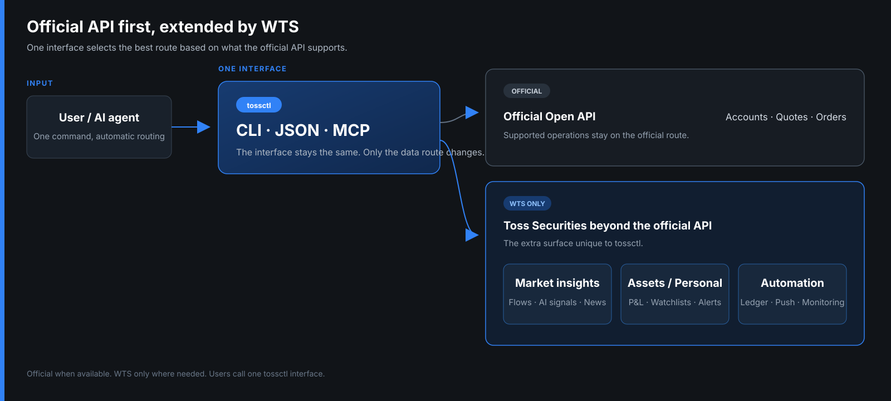
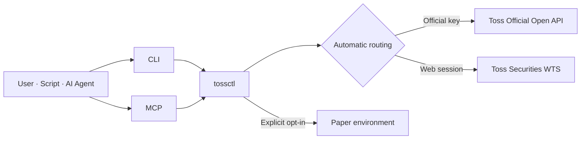
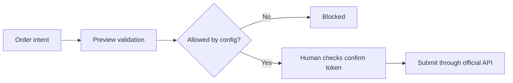
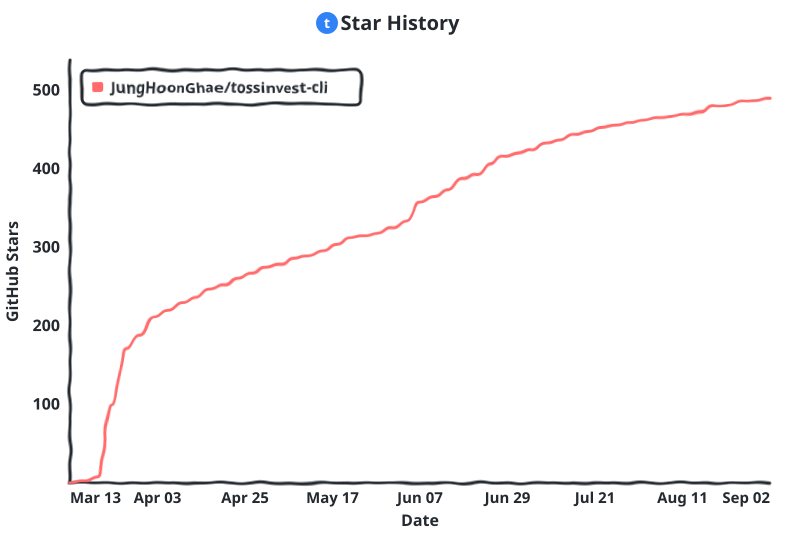

<p align="center">
  <a href="https://tossinvest-cli.vercel.app/"></a>
</p>

<p align="right"><a href="README.md">한국어</a> · <strong>English</strong></p>

<h1 align="center">tossinvest-cli</h1>

<p align="center">
  <strong>Toss Securities beyond the official API, through CLI and MCP.</strong>
  <br />Cover the official Open API and add WTS-only flows, AI signals, news, dividends, and watchlists through one <code>tossctl</code> interface.
</p>

<p align="center">
  <a href="https://github.com/JungHoonGhae/tossinvest-cli/actions/workflows/ci.yml"></a>
  <a href="https://github.com/JungHoonGhae/tossinvest-cli/releases"></a>
  <a href="LICENSE"></a>
</p>

<p align="center">
  <a href="#quick-start"><strong>Quick Start</strong></a> ·
  <a href="#why-tossctl"><strong>Why tossctl</strong></a> ·
  <a href="#cli-and-mcp"><strong>CLI and MCP</strong></a> ·
  <a href="#safety-model"><strong>Safety</strong></a> ·
  <a href="https://tossinvest-cli.vercel.app/en/docs"><strong>Docs</strong></a>
</p>

> [!WARNING]
> This is not an official Toss Securities product. Features outside the official Open API use Toss Securities' internal web API unofficially, may violate its Terms of Service, and can change without notice. You are responsible for account restrictions, losses, and other consequences of use.

## Why tossctl?

tossctl does not discard or bypass the official Open API. **It prefers the official path where supported and fills the gaps with Toss Securities WTS.** You call one CLI, JSON, or MCP interface without having to know which backend provides each feature.

<p align="center">
  
</p>

If the official API is enough, you keep its safer supported path. When analysis or automation needs more, the same tool opens the additional WTS surface. The [support scope](https://tossinvest-cli.vercel.app/en/docs/reference/support-scope) tracks the complete current comparison.

## Quick Start

macOS / Linux:

```bash
curl -fsSL https://raw.githubusercontent.com/JungHoonGhae/tossinvest-cli/main/install.sh | sh
tossctl doctor
tossctl auth login
tossctl account summary --output json
```

Windows PowerShell:

```powershell
irm https://raw.githubusercontent.com/JungHoonGhae/tossinvest-cli/main/install.ps1 | iex
```

You can open a link on your phone instead of scanning a QR code:

```bash
tossctl auth login --link
```

After signing in, approve **Keep this device signed in** on your phone. See the [installation guide](https://tossinvest-cli.vercel.app/en/docs/getting-started/installation) for Homebrew, source builds, and the complete authentication flow.

## What It Provides

| Area | Examples |
|---|---|
| Accounts and portfolios | Account summaries, positions, performance, dividends, transaction history |
| Quotes and markets | Quotes, order books, charts, flows, indices, news, screener, AI signals |
| Watchlists and settings | Watchlist folders, price alerts, hidden holdings, Open API allowed IPs |
| Trading | Korean and US stocks, fractional and conditional orders, cancel, amend, preview |
| Real-time and automation | WebSocket streams, SSE push, JSON and CSV output, API regression monitoring |
| Experimental | Isolated US-options paper-trading environment |

tossctl covers the official Open API and adds Toss-specific features discovered in WTS. See the [command reference](https://tossinvest-cli.vercel.app/en/docs/reference/commands) and [support scope](https://tossinvest-cli.vercel.app/en/docs/reference/support-scope) for the complete matrix.

## How It Works



- When an official key is present, supported operations prefer the official Open API.
- A web session unlocks reads and settings not exposed by the official API.
- Either credential is enough to start; connect both for the broadest surface.

## CLI and MCP

The same binary supports two usage paths.

| | CLI | MCP |
|---|---|---|
| Best for | Terminals, scripts, cron, pipelines | AI agents such as Claude Code, Codex, and Cursor |
| Run | `tossctl account summary` | Register `tossctl mcp` with a host |
| Strength | Full surface, deterministic output, easy automation | Natural-language calls and schema discovery |
| Output | table · JSON · CSV · stream | Structured MCP responses |

The MCP surface is **111 operations**, but it does not keep each one resident as a separate tool. Three catalog tools discover and load only the schema needed for each call, keeping context usage constant.

```bash
# Claude Code
claude mcp add tossctl tossctl mcp

# Shell-capable agents
tossctl ops list --query dividend
tossctl ops describe dividends
```

For other MCP hosts:

```json
{
  "mcpServers": {
    "tossinvest": { "command": "tossctl", "args": ["mcp"] }
  }
}
```

See the [AI agent guide](https://tossinvest-cli.vercel.app/en/docs/guide/agents) and [MCP guide](https://tossinvest-cli.vercel.app/en/docs/guide/mcp) for details.

## Preview

### Install through the first query

<p align="center">
  
</p>

### Connect MCP to an AI agent

<p align="center">
  
</p>

## Examples

```bash
# Accounts and portfolios
tossctl account overview
tossctl portfolio positions --output json

# Quotes and market data
tossctl quote get A005930
tossctl market index
tossctl market news --limit 10

# Real-time data
tossctl stream --trade A005930

# Watch for API contract changes
tossctl monitor api           # schema-probe 82 endpoints; exit 0 pass, 1 fail
```

Use `--output json` or `--output csv` to connect commands to automation. `tossctl <command> --help` always shows the current options.

## Safety Model

> [!IMPORTANT]
> Live trading is disabled after installation. Even after an action is enabled in config, every real submission requires a preview and confirmation token.



```bash
tossctl order preview --symbol AAPL --side buy --qty 1 --price 200
# Run order place only after a human checks the result and token
```

- Live place, cancel, and amend operations use only the official Open API path.
- WTS settings writes preview by default and re-read server state after execution.
- Irreversible operations require an additional acknowledgement.
- Paper trading has separate authorization and appears only after explicit opt-in.

See the [safety guide](https://tossinvest-cli.vercel.app/en/docs/guide/safety) and [`docs/configuration.md`](docs/configuration.md) for the full policy.

## Authentication and Diagnostics

| Purpose | Command |
|---|---|
| Sign in to a WTS web session | `tossctl auth login` |
| Sign in with a phone link | `tossctl auth login --link` |
| Check session state | `tossctl auth status` |
| Connect the official Open API | `tossctl openapi login` |
| Diagnose official API and allowed IPs | `tossctl openapi status` |
| Diagnose the complete environment | `tossctl doctor --report` |

When session expiry is near, `tossctl auth extend --if-expiring 48h` asks for phone approval only when needed. See [`docs/operations.md`](docs/operations.md) for scheduled checks and failure notifications.

## Experimental Features

US-options paper trading runs in a separate environment while it stabilizes. It stays hidden unless the user opts in, at which point its commands and MCP operations become discoverable.

```json
{
  "experimental": {
    "paper_trading": true
  }
}
```

Experimental APIs may change and never promote themselves to live-trading authorization. Their current status and limits are tracked in the [support scope](https://tossinvest-cli.vercel.app/en/docs/reference/support-scope).

## Documentation

| Document | Covers |
|---|---|
| [Quick start](https://tossinvest-cli.vercel.app/en/docs/getting-started/quickstart) | Install through first query |
| [Command reference](https://tossinvest-cli.vercel.app/en/docs/reference/commands) | All CLI commands and examples |
| [Support scope](https://tossinvest-cli.vercel.app/en/docs/reference/support-scope) | Official API and WTS feature matrix |
| [MCP](https://tossinvest-cli.vercel.app/en/docs/guide/mcp) | Agent setup and catalog design |
| [Configuration](docs/configuration.md) | Config fields and local state |
| [Operations](docs/operations.md) | 82 API probes and change monitoring |
| [Architecture](docs/architecture.md) | Routing, modules, and safety boundaries |
| [Changelog](CHANGELOG.md) | Release changes and contributor credits |

## Development and Contributing

```bash
make build
make test
make fmt
make tidy
```

Use [Issues](https://github.com/JungHoonGhae/tossinvest-cli/issues) for bugs and proposals, and Pull Requests for changes. See [`CONTRIBUTING.md`](CONTRIBUTING.md) for project conventions and [`SECURITY.md`](SECURITY.md) for security reports.

## Sponsors

<p align="center">
  <a href="https://github.com/sponsors/JungHoonGhae"></a>
</p>

<!-- sponsors:start -->

<p align="center">
  <a href="https://github.com/sponsors/JungHoonGhae" title="private sponsor"></a>
</p>

<p align="center"><sub><strong>1</strong> person backs my open-source work (one-time included). Sponsorship funds my projects, tossinvest-cli included.</sub></p>

<!-- sponsors:end -->

## Contributors

Thanks to everyone who has helped build tossinvest-cli. See [`CONTRIBUTING.md`](CONTRIBUTING.md) to join in.

[](https://github.com/JungHoonGhae/tossinvest-cli/graphs/contributors)

## Star History

<!-- star-history:start -->
<picture>
  <source media="(prefers-color-scheme: dark)" srcset="docs/assets/star-history/star-history-v2-dark.svg">
  
</picture>
<!-- star-history:end -->

## License

[MIT](LICENSE)
