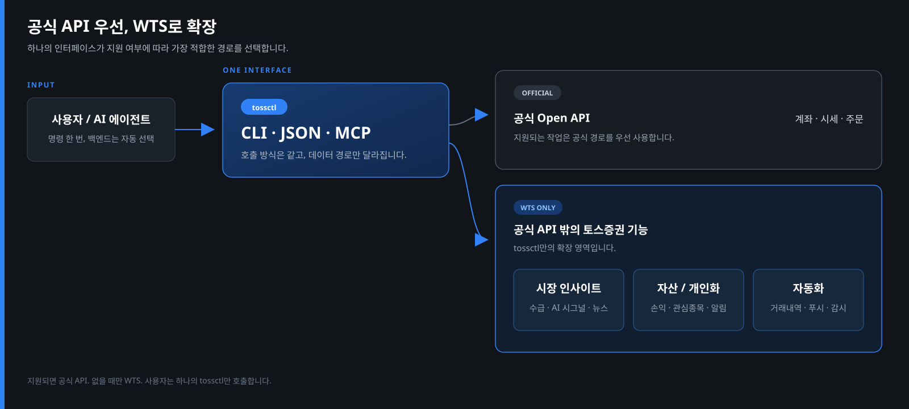
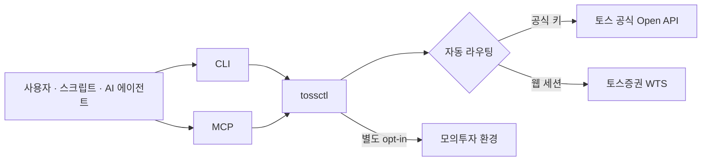
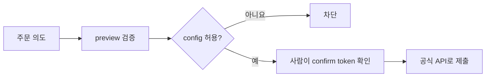

<p align="center">
  <a href="https://tossinvest-cli.vercel.app/"></a>
</p>

<p align="right"><strong>한국어</strong> · <a href="README.en.md">English</a></p>

<h1 align="center">tossinvest-cli</h1>

<p align="center">
  <strong>공식 API로는 못 보는 토스증권 데이터까지, CLI와 MCP로.</strong>
  <br />공식 Open API 범위를 포함하고 수급·AI 시그널·뉴스·배당·관심종목 등 WTS 전용 기능까지 하나의 <code>tossctl</code>로 연결합니다.
</p>

<p align="center">
  <a href="https://github.com/JungHoonGhae/tossinvest-cli/actions/workflows/ci.yml"></a>
  <a href="https://github.com/JungHoonGhae/tossinvest-cli/releases"></a>
  <a href="LICENSE"></a>
</p>

<p align="center">
  <a href="#빠른-시작"><strong>빠른 시작</strong></a> ·
  <a href="#왜-tossctl인가"><strong>왜 tossctl인가</strong></a> ·
  <a href="#cli와-mcp"><strong>CLI와 MCP</strong></a> ·
  <a href="#안전-모델"><strong>안전</strong></a> ·
  <a href="https://tossinvest-cli.vercel.app/docs"><strong>문서</strong></a>
</p>

> [!WARNING]
> 이 프로젝트는 토스증권 공식 제품이 아닙니다. 공식 Open API 외 기능은 토스증권 웹 내부 API를 비공식적으로 사용하며, 이용약관 위반에 해당할 수 있고 예고 없이 변경될 수 있습니다. 계좌 제한·손실 등 사용 결과는 사용자 본인의 책임입니다.

## 왜 tossctl인가?

공식 Open API를 버리거나 우회하기 위한 도구가 아닙니다. **공식 API가 지원하는 작업은 공식 경로를 우선 사용하고, 지원하지 않는 토스증권 기능은 WTS로 보완**합니다. 사용자는 어느 API에 있는지 구분하지 않고 같은 CLI·JSON·MCP 인터페이스로 호출할 수 있습니다.

<p align="center">
  
</p>

공식 API만 필요한 사용자는 더 안전한 공식 경로를 그대로 쓰고, 그 범위를 넘어서는 분석·자동화가 필요할 때만 WTS 기능을 함께 얻습니다. 전체 비교는 [지원 범위](https://tossinvest-cli.vercel.app/docs/reference/support-scope)에서 추적합니다.

## 빠른 시작

macOS / Linux:

```bash
curl -fsSL https://raw.githubusercontent.com/JungHoonGhae/tossinvest-cli/main/install.sh | sh
tossctl doctor
tossctl auth login
tossctl account summary --output json
```

Windows PowerShell:

```powershell
irm https://raw.githubusercontent.com/JungHoonGhae/tossinvest-cli/main/install.ps1 | iex
```

QR 대신 휴대폰에서 링크를 열어 로그인할 수도 있습니다.

```bash
tossctl auth login --link
```

로그인 후 휴대폰의 **이 기기 로그인 유지** 확인까지 완료하세요. Homebrew·소스 빌드와 자세한 인증 과정은 [설치 문서](https://tossinvest-cli.vercel.app/docs/getting-started/installation)에 있습니다.

## 무엇을 할 수 있나요?

| 영역 | 예시 |
|---|---|
| 계좌·포트폴리오 | 계좌 요약, 보유 종목, 수익률, 배당, 거래 내역 |
| 시세·시장 | 현재가, 호가, 차트, 수급, 지수, 뉴스, 스크리너, AI 시그널 |
| 관심종목·설정 | 관심종목 폴더, 목표가 알림, 숨긴 보유종목, Open API 허용 IP |
| 거래 | 국내·미국 주식, 소수점·조건 주문, 취소·정정, 주문 미리보기 |
| 실시간·자동화 | WebSocket 스트림, SSE 푸시, JSON·CSV 출력, API 회귀 감시 |
| 실험적 기능 | 격리된 미국 옵션 모의투자 환경 |

공식 Open API의 지원 범위를 포함하며, WTS에서 확인된 토스 고유 기능도 제공합니다. 전체 명령과 지원 여부는 [명령 레퍼런스](https://tossinvest-cli.vercel.app/docs/reference/commands)와 [지원 범위](https://tossinvest-cli.vercel.app/docs/reference/support-scope)에서 확인하세요.

## 동작 방식



- 공식 키가 있으면 지원되는 작업은 공식 Open API를 우선 사용합니다.
- 웹 세션은 공식 API에 없는 조회·설정 기능을 엽니다.
- 인증 하나만으로 시작할 수 있고, 둘 다 연결하면 가장 넓은 기능 범위를 사용할 수 있습니다.

## CLI와 MCP

같은 바이너리를 두 가지 방식으로 사용합니다.

| | CLI | MCP |
|---|---|---|
| 적합한 용도 | 터미널, 스크립트, cron, 파이프라인 | Claude Code·Codex·Cursor 등 AI 에이전트 |
| 실행 | `tossctl account summary` | `tossctl mcp`를 호스트에 등록 |
| 장점 | 전 기능, 결정적 출력, 자동화하기 쉬움 | 자연어 호출, 스키마 자동 탐색 |
| 출력 | table · JSON · CSV · stream | 구조화된 MCP 응답 |

MCP의 API 표면은 **111개 오퍼레이션**이지만 이를 개별 도구로 상주시켜 두지 않습니다. 필요한 스키마만 찾고 호출하는 세 개의 카탈로그 도구로 컨텍스트 사용량을 일정하게 유지합니다.

```bash
# Claude Code
claude mcp add tossctl tossctl mcp

# 셸을 사용하는 에이전트
tossctl ops list --query dividend
tossctl ops describe dividends
```

다른 MCP 호스트는 다음 설정을 사용합니다.

```json
{
  "mcpServers": {
    "tossinvest": { "command": "tossctl", "args": ["mcp"] }
  }
}
```

자세한 내용은 [AI 에이전트 가이드](https://tossinvest-cli.vercel.app/docs/guide/agents)와 [MCP 가이드](https://tossinvest-cli.vercel.app/docs/guide/mcp)를 참고하세요.

## 사용 모습

### 설치에서 첫 조회까지

<p align="center">
  
</p>

### AI 에이전트에 MCP 연결

<p align="center">
  
</p>

## 사용 예

```bash
# 계좌와 포트폴리오
tossctl account overview
tossctl portfolio positions --output json

# 시세와 시장 데이터
tossctl quote get A005930
tossctl market index
tossctl market news --limit 10

# 실시간 데이터
tossctl stream --trade A005930

# API 계약 변경 감시
tossctl monitor api           # 82개 endpoint schema probe; 통과 0, 실패 1
```

명령은 `--output json` 또는 `--output csv`로 자동화에 연결할 수 있습니다. `tossctl <command> --help`에서 항상 현재 옵션을 확인할 수 있습니다.

## 안전 모델

> [!IMPORTANT]
> 실거래는 설치 직후 모두 꺼져 있습니다. 설정에서 해당 액션을 허용하더라도 실제 제출 전마다 미리보기와 확인 토큰이 필요합니다.



```bash
tossctl order preview --symbol AAPL --side buy --qty 1 --price 200
# 사람이 결과와 token을 확인한 뒤에만 order place 실행
```

- 실주문 생성·취소·정정은 공식 Open API 경로만 사용합니다.
- WTS 설정 변경도 기본값은 preview이며 실행 후 서버 상태를 다시 확인합니다.
- 되돌릴 수 없는 작업은 추가 확인을 요구합니다.
- 모의투자는 실거래 권한과 분리되어 있으며 명시적으로 활성화한 사용자에게만 노출됩니다.

전체 정책과 설정 예시는 [안전 가이드](https://tossinvest-cli.vercel.app/docs/guide/safety)와 [`docs/configuration.md`](docs/configuration.md)를 참고하세요.

## 인증과 상태 확인

| 목적 | 명령 |
|---|---|
| WTS 웹 세션 로그인 | `tossctl auth login` |
| 휴대폰 링크 로그인 | `tossctl auth login --link` |
| 세션 상태 확인 | `tossctl auth status` |
| 공식 Open API 연결 | `tossctl openapi login` |
| 공식 API·허용 IP 진단 | `tossctl openapi status` |
| 전체 환경 진단 | `tossctl doctor --report` |

세션 만료가 가까우면 `tossctl auth extend --if-expiring 48h`로 필요한 때에만 휴대폰 승인을 요청할 수 있습니다. 예약 실행과 장애 알림 구성은 [`docs/operations.md`](docs/operations.md)에 있습니다.

## 실험적 기능

미국 옵션 모의투자는 안정화 중인 별도 환경입니다. 일반 사용자에게는 숨겨져 있고 다음 설정으로 opt-in한 경우에만 명령과 MCP 오퍼레이션에 나타납니다.

```json
{
  "experimental": {
    "paper_trading": true
  }
}
```

실험적 API는 변경될 수 있으며 실거래로 자동 승격되지 않습니다. 상태와 제한은 [지원 범위 문서](https://tossinvest-cli.vercel.app/docs/reference/support-scope)에 표시합니다.

## 문서

| 문서 | 내용 |
|---|---|
| [빠른 시작](https://tossinvest-cli.vercel.app/docs/getting-started/quickstart) | 설치 후 첫 조회까지 |
| [명령 레퍼런스](https://tossinvest-cli.vercel.app/docs/reference/commands) | 전체 CLI 명령과 예시 |
| [지원 범위](https://tossinvest-cli.vercel.app/docs/reference/support-scope) | 공식 API·WTS 기능 비교 |
| [MCP](https://tossinvest-cli.vercel.app/docs/guide/mcp) | 에이전트 등록과 카탈로그 구조 |
| [설정](docs/configuration.md) | config 필드와 로컬 상태 |
| [운영](docs/operations.md) | 82개 API probe와 변경 감시 |
| [아키텍처](docs/architecture.md) | 라우팅·모듈·안전 경계 |
| [변경 내역](CHANGELOG.md) | 버전별 변경 사항과 기여자 크레딧 |

## 개발과 기여

```bash
make build
make test
make fmt
make tidy
```

버그와 제안은 [Issues](https://github.com/JungHoonGhae/tossinvest-cli/issues), 변경 사항은 Pull Request로 보내주세요. 자세한 기준은 [`CONTRIBUTING.md`](CONTRIBUTING.md), 보안 문제는 [`SECURITY.md`](SECURITY.md)를 확인하세요.

## 후원

<p align="center">
  <a href="https://github.com/sponsors/JungHoonGhae"></a>
</p>

<!-- sponsors:start -->

<p align="center">
  <a href="https://github.com/sponsors/JungHoonGhae" title="비공개 후원자 / private sponsor"></a>
</p>

<p align="center"><sub>현재 <strong>1</strong>분이 제 오픈소스 작업을 후원하고 있습니다 (일회성 포함). 후원은 tossinvest-cli를 포함한 제 작업 전반에 쓰입니다.</sub></p>

<!-- sponsors:end -->

## Contributors

기여해 주신 모든 분께 감사합니다. 참여 방법은 [`CONTRIBUTING.md`](CONTRIBUTING.md)를 참고하세요.

[](https://github.com/JungHoonGhae/tossinvest-cli/graphs/contributors)

## Star History

<!-- star-history:start -->
<picture>
  <source media="(prefers-color-scheme: dark)" srcset="docs/assets/star-history/star-history-v2-dark.svg">
  
</picture>
<!-- star-history:end -->

## License

[MIT](LICENSE)
