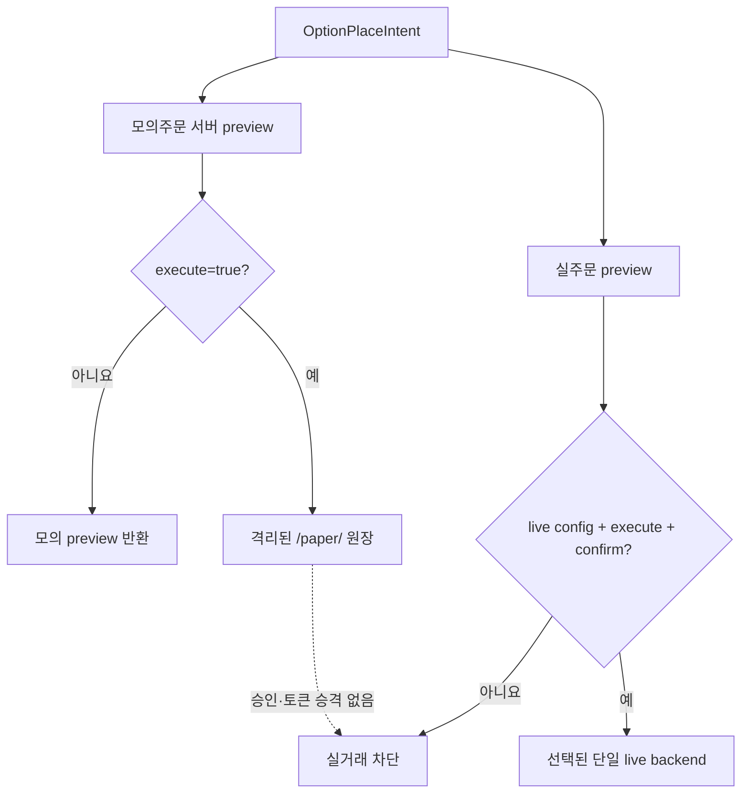

# ADR 0005 — 모의 실행을 격리하고 롤아웃을 옵트인으로 관리한다

- 상태: 채택
- 날짜: 2026-09-03
- 관련: `internal/papertrading`, `internal/orderintent`, `internal/ops`, `internal/monitor`

## 맥락

미국 옵션 모의투자 API는 현재 WTS 번들에 보이고 가상 입금·주문 준비·생성·단건 및 일괄
취소가 실제 모의 원장에서 동작한다. 그러나 `/api/v1/paper/init`은 같은 세션에서 불투명한
500을 반환하고, 교육·파생상품 자격 플래그가 false여도 주문이 성공한다. UI와 서버 계약이
아직 일반 공개 상태로 수렴했다고 볼 수 없다.

모의 주문과 실주문은 경제적 의도는 같지만 승인 의미가 다르다. 모의투자의 낮은 금전 위험을
이유로 실주문 가드까지 약화시키거나, 반대로 실주문 확인 토큰을 모의 원장에 억지로 재사용하면
두 환경의 경계가 흐려진다.

## 결정

- 제품 도메인은 둘 다 `securities`, 실행 환경은 `paper`와 `live`로 분리한다. 접근 경로인
  `wts`/`official`은 또 다른 축이다.
- `internal/papertrading`만 `/paper/` 읽기와 쓰기를 소유한다. 모의 쓰기는 기본 preview,
  명시적 `execute=true`를 요구하는 `simulation_execute` 승인 방식을 사용하며 실거래 config나
  confirm token을 권한으로 재사용하지 않는다.
- 옵션 주문의 경제적 내용은 `internal/orderintent.OptionPlaceIntent`로 공유한다. `paper order
  live-preview`는 같은 의도를 일반 `trading.Service`에 넘겨 새로운 실주문 preview와 confirm
  token을 발급할 뿐, 주문을 제출하거나 모의 승인을 승격하지 않는다.
- 기능 수명주기는 `rolling_out`, 안정성은 `experimental`로 시작한다.
  `experimental.paper_trading=true`로 옵트인한 사용자에게만 CLI 도움말, ops, MCP와 전용
  회귀 probe를 노출한다. README와 changelog에는 실험 기능임을 명시한다.
- 번들 UI flag, 활성 build 집합, critical endpoint 존재, 라이브 관측, 구현 상태와 승격 심사를
  `wts-endpoints.json`의 별도 `rolling_features` 영역에서 추적한다.

## stable 승격 기준

다음을 모두 충족하고 별도 심사를 기록한 뒤에만 옵트인 게이트를 제거한다.

1. critical endpoint와 UI flag가 최소 3개 연속 활성 WTS build에서 유지된다.
2. 최소 7일 동안 7회 연속 전용 live probe가 통과한다.
3. 공식 UI가 일반 공개되고 prepare/create/cancel 계약이 그대로 유지된다.
4. 초기화·교육·주문 가능 상태의 관계가 일반 증권계좌와 자격 보유 계좌에서 일관된다.
5. `/paper/init`을 포함해 설명되지 않은 5xx가 남아 있지 않다.

현재는 `/paper/init`의 500과 상태 불일치 때문에 승격할 수 없다.

## 결과

- 옵트인하지 않은 사용자의 일반 카탈로그와 `monitor api`는 실험 기능의 장애에 영향받지 않는다.
- 옵트인 사용자는 모의 원장을 자동화할 수 있지만, 실계좌 전환 시 기존 실거래 가드를 처음부터
  다시 통과한다.
- 교육 session 완료는 합법적 흐름과 서버 영수증이 확인될 때까지 callable 기능으로 만들지 않고
  mutation inventory에 `human-only` 후보로 남긴다.
- 상류 계약이 바뀌면 실험 표면만 수정하거나 제거할 수 있으며 안정 API 호환성을 약속하지 않는다.

## 재검토 조건

위 stable 승격 기준을 모두 만족하거나, 토스가 정식 모의투자/Open API 계약을 제공하면 이 결정을
재검토한다. 서버가 모의 원장 격리를 보장하지 못한다는 증거가 나오면 기능을 즉시 비활성화한다.
