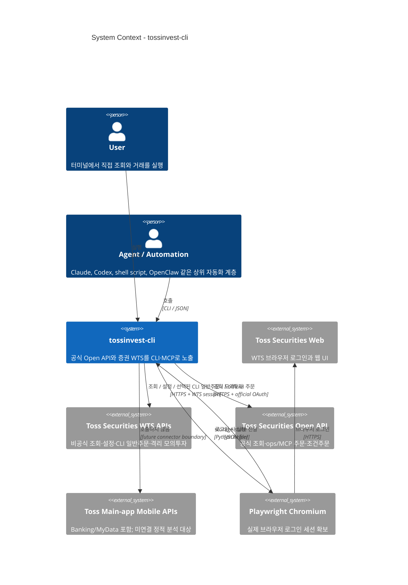
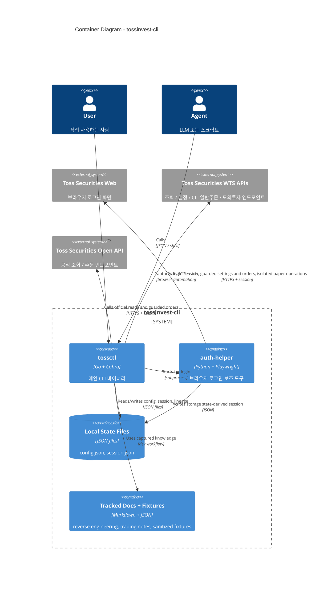
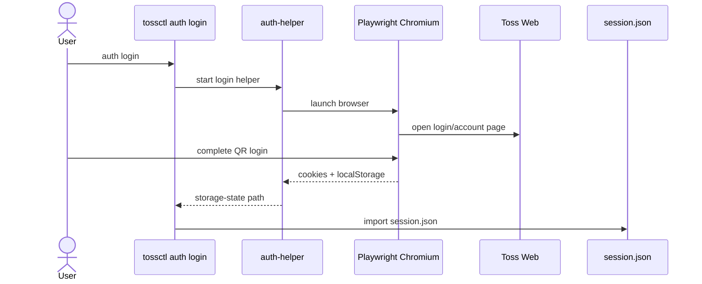
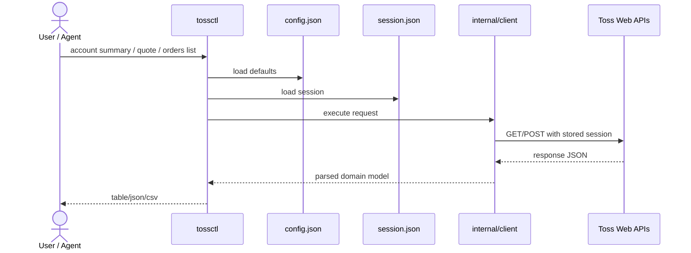
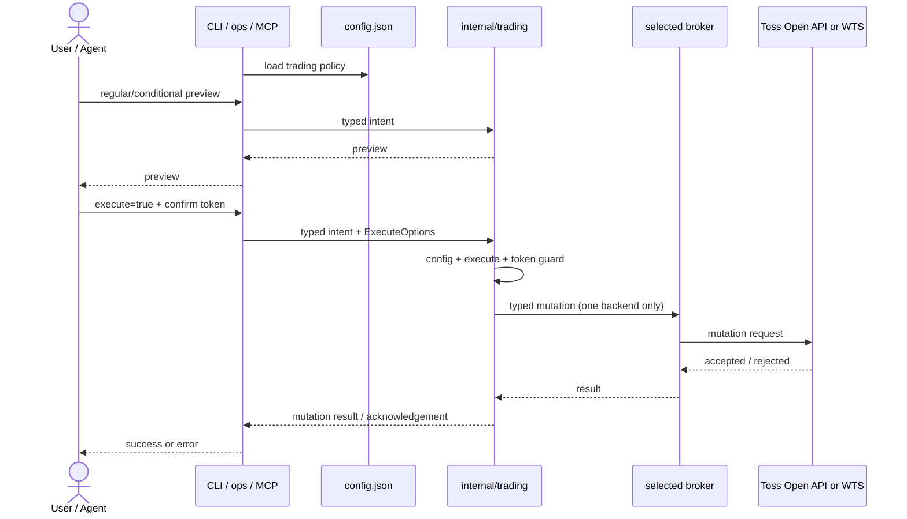
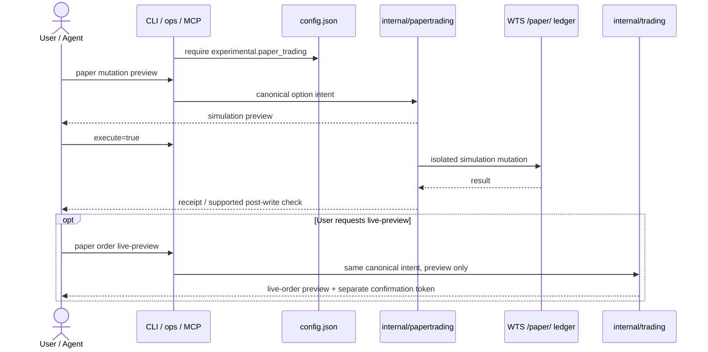

# Architecture

`tossinvest-cli`는 토스증권 공식 Open API와 증권 웹 세션(WTS)을 하나의 CLI·MCP 표면으로
연결합니다. 현재 구조는 `공식 API connector + WTS browser-session connector + Go
application core + 로컬 상태 파일`로 나뉩니다. 일반 Toss Banking/MyData 모바일 API는
정적 분석 대상일 뿐 아직 connector가 아닙니다.

이 문서는 현재 저장소에 구현된 기준으로 아키텍처를 정리합니다. 목표는 두 가지입니다.

- 사람이 전체 구조를 빠르게 이해할 수 있게 하기
- 이후 LLM이나 다른 자동화 도구가 같은 경계를 기준으로 기능을 확장할 수 있게 하기

## 현재 상태

현재 구현 범위는 아래와 같습니다.

- 브라우저 로그인 기반 세션 저장과 재사용
  - QR 1차 + "이 기기 로그인 유지" 2차 확인까지 대기 후 저장 → persistent SESSION (서버 idle timeout 면제)
  - 링크 로그인 지원 — `auth login --link` (휴대폰에서 탭), `--headless [--qr-output <path>]` (SSH/CI 호환)
  - `auth extend` — 토스 서버 측 ~7일 활성 timer를 폰 푸시 승인 한 번으로 연장 (1년 SESSION 쿠키와 별개의 만료 시계). 24h 미만 남았을 때 모든 명령에서 stderr 한 줄 경고
- 계좌, 포트폴리오, 미체결 주문, 관심종목, 시세 조회
- 관심종목 폴더, 목표가 알림, 숨긴 보유종목의 preview/confirm 기반 설정 변경
- opt-in 미국 옵션 모의투자: 격리 원장 조회·주문과 실주문 preview 전환
- `orders completed`, `order show <id>` 기반 주문 상태 조회
- 거래내역 ledger: `transactions list/overview` — 매매/입출금/배당/주식입출고 + 현금 overview (KR/US, table/JSON/CSV, 200일 캡)
- 실시간 푸시: `push listen` — 토스 SSE 채널(`sse-message.tossinvest.com`) 구독으로 주문/가격/보유종목 변경 알림을 JSONL 스트림으로 출력 (이벤트 분류는 [`docs/reverse-engineering/push-events.md`](reverse-engineering/push-events.md))
- 거래 베타
  - `US/KR buy/sell limit` + `US fractional (market)`
  - sell: `trading.sell=true`, fractional: `trading.fractional=true` (US/KR 은 대칭 — `place` 만 필요)
  - `KRW`
  - `place`
  - same-day pending `cancel`
  - `amend` wiring 존재, 추가 live 검증 필요

거래는 기본적으로 꺼져 있습니다. 사용자가 `config.json`에서 기능별로 직접 열고, 그 다음에도 런타임 flag(`--execute` / `--confirm <token>`)를 통과해야만 mutation이 실행됩니다.

## 설계 원칙

- 기본은 `read-only`
- 로그인 획득과 API 호출을 분리
- 사람과 에이전트 모두 같은 CLI 표면을 사용
- 거래 mutation은 별도 gate를 거치며, 검증 가능한 WTS 설정은 사후 재조회하고 주문의
  transport error는 결과 불명확으로 취급해 상태 확인 전 재시도하지 않음
- 상태는 로컬 파일로 명시적으로 저장
- discovery 문서와 fixture는 코드와 분리해서 유지

## 용어와 분류 축

사용자에게 보이는 제품, 실제 호출 통로, 실행 입구를 한 단어인 “플랫폼”으로 합치지 않는다.
기능을 다음 개념 축으로 독립 분류한다. 이 중 `domain`과 `backend`는 현재 operation
레지스트리의 machine-readable 필드이고, surface와 UI provenance는 아키텍처·discovery
문서의 분류다.

| 축 | 질문 | 현재 값 |
|---|---|---|
| `domain` | 누구의 어떤 금융 기능인가? | `securities`, `banking`, `mydata`, `system` |
| backend / source | 어떤 자격증명과 전송 계약으로 호출하는가? | operation: `""`, `wts`, `auto`, `none`; CLI annotation: `official`, `wts`, `both`, `local`; 향후 `mobile` |
| surface | 사용자가 어디서 호출하는가? | CLI, ops, MCP |
| UI provenance | 기능을 어디서 발견했는가? | WTS 화면, 일반 Toss 앱의 증권 화면, UI 없는 검증된 API |

`증권`은 제품 domain이고 `WTS`는 backend다. 따라서 “웹 UI가 없다”는 이유만으로 mobile
API가 되지 않으며, 일반 Toss 앱에 보인다는 이유만으로 Banking/MyData와 증권이 같은 토큰을
쓰지도 않는다. 정식 예시는 `accumulation_funding_status = securities + wts`다. 예전
`banking_status` 이름은 호환 alias일 뿐 일반 Banking 기능을 뜻하지 않는다.

`portfolio folder`는 증권 보유종목을 앱의 사용자 정의 분류대로 보여주는 **읽기 전용
보유종목 그룹**이다. `watchlist folder/group`는 관심종목 membership을 담고 생성·이름 변경·
삭제할 수 있는 **관심종목 자원**이다. 둘 다 UI에서 “폴더”로 보이지만 API·키·쓰기 정책이
다르므로 코드와 문서에서 서로의 줄임말로 사용하지 않는다.

새 connector는 자격증명·host·header/cipher·동의·secret storage 경계를 모두 검증한 뒤에만
backend로 추가한다. 자세한 결정은 [ADR 0003](adr/0003-separate-product-domain-from-access-channel.md)에
기록한다.

## System Context

## Container View

## Component View

```mermaid
C4Component
title Component Diagram - tossctl

Container(cli, "tossctl", "Go CLI", "Main binary")

Container_Boundary(core, "Application Core") {
  Component(commands, "cmd/tossctl", "Cobra commands", "Command entrypoints and flag parsing")
  Component(opsSvc, "internal/ops", "Operation registry", "Machine-readable domain/backend/params/mutation/probe contracts")
  Component(mcpSvc, "internal/mcp", "MCP adapter", "Lists, describes, and calls the operation registry")
  Component(configSvc, "internal/config", "Config service", "Loads config.json and schema-aware defaults")
  Component(authSvc, "internal/auth", "Auth service", "Runs auth-helper and imports browser session")
  Component(doctorSvc, "internal/doctor", "Doctor service", "Checks local environment, config, session, helper readiness")
  Component(routerSvc, "internal/hybrid", "Backend router", "Chooses official/WTS reads and one regular-order backend; never retries writes across backends")
  Component(clientSvc, "internal/client", "WTS connector", "Uses the Securities web session and parses WTS responses")
  Component(officialSvc, "internal/official", "Official connector", "Uses Open API OAuth and owns order transport")
  Component(tradingSvc, "internal/trading", "Trading service", "Preview, gate, broker-agnostic mutation orchestration, unknown-outcome boundary")
  Component(preferenceSvc, "internal/watchlist · pricealert · hiddenholding", "WTS preference services", "Session-bound preview, confirmation, post-read; irreversible acknowledgement when required")
  Component(paperSvc, "internal/papertrading", "Paper trading service", "Opt-in simulation preview, execution, and supported post-write checks")
  Component(confirmSvc, "internal/confirmation", "Confirmation tokens", "Signs exact state and intent; not a distributed single-use lock")
  Component(monitorSvc, "internal/monitor", "Contract monitor", "Runs registry-derived and CLI-only read probes")
  Component(intentSvc, "internal/orderintent", "Intent normalization", "Canonical order inputs and confirm tokens")
  Component(sessionSvc, "internal/session", "Session store", "Persists imported browser session")
  Component(outputSvc, "internal/output", "Renderers", "Table / JSON / CSV output")
}

Rel(commands, configSvc, "Loads config")
Rel(commands, authSvc, "Runs login/status/logout")
Rel(commands, doctorSvc, "Runs doctor")
Rel(commands, routerSvc, "Executes routed reads")
Rel(commands, tradingSvc, "Executes preview/place/cancel/amend")
Rel(commands, preferenceSvc, "Executes guarded preference changes")
Rel(commands, paperSvc, "Executes opt-in paper operations")
Rel(mcpSvc, opsSvc, "Publishes operation contracts")
Rel(opsSvc, routerSvc, "Dispatches typed reads")
Rel(opsSvc, tradingSvc, "Dispatches guarded orders")
Rel(opsSvc, preferenceSvc, "Dispatches guarded preference changes")
Rel(opsSvc, paperSvc, "Publishes experimental paper operations")
Rel(monitorSvc, opsSvc, "Derives dependency probes")
Rel(routerSvc, clientSvc, "Routes WTS reads")
Rel(routerSvc, officialSvc, "Routes official reads")
Rel(tradingSvc, intentSvc, "Uses canonical inputs")
Rel(tradingSvc, routerSvc, "Top-level CLI regular orders use one selected broker")
Rel(tradingSvc, officialSvc, "ops/MCP and conditional orders use official transport")
Rel(preferenceSvc, clientSvc, "Runs WTS mutation + post-read")
Rel(preferenceSvc, confirmSvc, "Binds session, state, intent, expiry")
Rel(paperSvc, clientSvc, "Uses dedicated /paper/ endpoints")
Rel(paperSvc, intentSvc, "Reuses canonical option intent")
Rel(authSvc, sessionSvc, "Stores session")
Rel(clientSvc, sessionSvc, "Reads session")
Rel(commands, outputSvc, "Renders results")
```

## Key Flows

### 1. Browser-assisted login

### 2. WTS read-only command

공식 지원 조회는 같은 command/operation에서 `internal/hybrid`가 `internal/official`로 보내며
공식 자격증명을 사용한다. `auto` fallback은 조회에만 적용하고, 주문·설정 쓰기는 백엔드 사이를
재시도하지 않는다.

### 3. Trading mutation with safety gates

표면별 broker 구성이 다르다. 최상위 `tossctl order place|cancel|amend`는 실행 시작 때
official 또는 WTS 한 경로를 선택하며, 실패 뒤 다른 경로로 넘어가지 않는다. `tossctl ops call`과
MCP의 regular/conditional order operation은 machine-readable `backend=""` 계약대로
official-only다. 조건주문은 모든 표면에서 official-only다. 현재 official 주문은 응답 뒤
자동 post-read를 하지 않으므로 transport error가 나면 성공/실패를 단정하지 않고 관련 주문
상태를 확인한 뒤에만 재시도한다.

### 4. Paper simulation and live preview handoff

모의 실행은 실거래 권한이나 확인 토큰을 열지 않는다. `live-preview`도 의도 변환만 수행하며,
실주문은 별도의 실거래 게이트를 다시 모두 통과해야 한다.

## Safety Model

모든 쓰기는 preview가 기본이며 실행 환경에 따라 다음 경계를 사용합니다.

| 쓰기 종류 | 실행 조건 | 검증·격리 |
|---|---|---|
| 실거래 주문 | `config.json`의 기능별 게이트와 `allow_live_order_actions` + `--execute` + 해당 preview의 `--confirm <token>` | 한 backend만 호출. 전송 결과가 불명확하면 상태 확인 전 재시도 금지 |
| WTS 사용자 설정 | `--execute` + 해당 preview의 `--confirm <token>`; 되돌릴 수 없는 삭제는 별도 acknowledgement | 계좌·세션·현재 상태에 묶인 토큰과 사후 재조회 |
| 모의투자 | `experimental.paper_trading=true` + `--execute` (`simulation_execute`) | `/paper/` 격리 원장만 호출하며 실거래 권한을 부여하지 않음 |

실거래의 기능별 게이트는 `place`, `cancel`, `amend`, `conditional`이고, `sell`과
`fractional`은 사용자 자가 제한이다. 환전 동의 자동화는
`dangerous_automation.accept_fx_consent`로 별도 관리한다.

> `v0.4.3`에서 `trading.grant`, `dangerous_automation.complete_trade_auth`, `dangerous_automation.accept_product_ack`는 제거되었습니다 — 모두 실제로 어떤 동작도 제어하지 않던 dead toggle이었습니다. `v0.5.0`에서는 중복이던 TTL grant 레이어(`internal/permissions`)도 제거되었고, `v0.5.x`에서는 거짓 이름이던 `--dangerously-skip-permissions` 런타임 게이트도 은퇴했습니다(가리킬 permissions 가 없고 `--execute`와 의미 중복 — 실제 안전장치는 주문별 `--confirm <token>`). 구 config에 남아있어도 무시되며, 일반 명령 실행 시 stderr 경고 1줄(24h backoff)로 안내되고 `tossctl doctor`의 `legacy_config` 체크에서도 감지됩니다. 은퇴한 플래그는 한 릴리즈 동안 deprecated no-op alias로 받아들입니다.

## Local State

로컬 상태는 아래 파일로 관리됩니다.

| File | Role | Mode |
|---|---|---|
| `config.json` | 거래 기능 허용 여부 | `0o600` |
| `session.json` | 브라우저에서 가져온 세션 (쿠키 + storage) | `0o600` |
| `trading-lineage.json` | amend/cancel 후 order ref 추적 | `0o600` |

상태 디렉토리 (`~/Library/Application Support/tossctl/` 등)는 `0o700` 으로 생성되어 같은 호스트의 다른 사용자가 목록 조회 못함. 기존 v0.4.0 이전에 생성된 디렉토리는 `0o755`로 남아있을 수 있으므로 `tossctl doctor --report` 의 `file_modes` 항목에서 확인 + 필요 시 `chmod 0700` 수동 정리.

기본 경로는 `tossctl doctor`와 `tossctl config show`로 확인할 수 있습니다.

## Package Map

| Package | Role |
|---|---|
| `cmd/tossctl` | 명령 진입점 |
| `internal/config` | config.json 로드, 기본값, schema |
| `internal/auth` | 로그인 orchestration, 세션 import |
| `auth-helper/` | Python + Playwright 로그인 보조 |
| `internal/client` | Toss 웹 API 호출과 응답 파싱 |
| `internal/official` | 공식 Open API OAuth 전송과 공식 응답 파싱 |
| `internal/hybrid` | 조회 fallback과 CLI 일반주문의 단일 backend 선택 |
| `internal/ops` | operation·parameter·mutation·probe 계약 레지스트리 |
| `internal/mcp` | operation 레지스트리의 3-tool MCP adapter |
| `internal/trading` | preview, gate, mutation orchestration |
| `internal/watchlist` | 관심종목 폴더·membership preview/confirm/post-read |
| `internal/pricealert` | 목표가 알림 preview/confirm/post-read |
| `internal/hiddenholding` | 숨긴 보유종목 preview/confirm/post-read |
| `internal/papertrading` | opt-in 모의 원장 조회·쓰기와 live-preview 변환 |
| `internal/confirmation` | deterministic·time-bound confirmation primitives |
| `internal/monitor` | 레지스트리 파생 및 CLI 전용 read probe 실행 |
| `internal/orderintent` | canonical input, confirm token |
| `internal/session` | session.json 저장 |
| `internal/output` | table/json/csv 렌더링 |
| `docs/reverse-engineering` | read-only discovery 문서 |
| `docs/trading` | trading discovery 문서 |

## Current Gaps

아래는 아직 남아 있는 항목입니다.

- `amend`의 추가 live 검증
- `place`와 `amend`의 상태 판별 추가 검증
- 비소수점 시장가 주문 (US/KR)
- interactive auth challenge가 필요한 mutation 분기 일반화
- 일부 계정에서 `/paper/init`이 반환하는 불투명한 500의 서버 측 허용 조건 확인

## Related Docs

- [`configuration.md`](./configuration.md)
- [`trading/README.md`](./trading/README.md)
- [`reverse-engineering/`](./reverse-engineering/)
