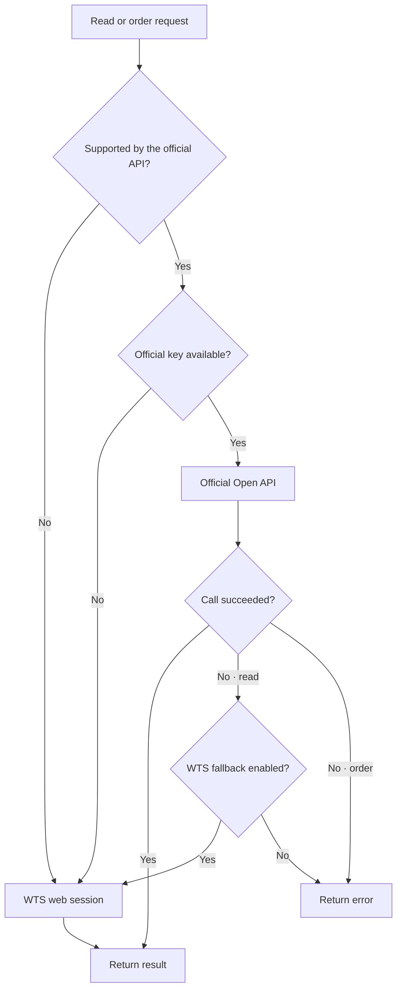

tossctl works fully with just a **web session (WTS)**. Registering an official Toss Open API
key turns on **auto-routing**: features the official API supports go through the official OAuth
path, and everything else goes through WTS. Everything works without a key too, and you can add
one whenever you like.

## Official Open API vs WTS web session

These are the two paths tossctl uses to reach Toss Securities. They behave differently, so
understanding the difference tells you which combination you need.

| | Official Open API | WTS web session |
|---|---|---|
| What | Toss's **official** OAuth REST API | **Unofficial reuse** of the internal API behind Toss web/app |
| Auth | API Key·Secret → OAuth access token | QR + phone-approved login (session cookie) |
| Renewal | Tokens **auto-reissued** (no interruption) | ~7-day activity expiry, needs **phone push approval** |
| Coverage | Officially-supported features (accounts, quotes, orders, …) | **All of WTS** — flows, indices, AI signals, screener, real-time push, fractional orders, etc. |
| Stability | High (official contract, versioned spec) | Unofficial, **can change without notice** |
| Prerequisites | Pre-application + approval + **allowed-IP registration** | Login only |
| Terms (TOS) | Officially allowed | **May violate TOS** |
| Unattended (CI/server/agent) | Suitable | Periodic human (phone) interaction |

In short — **the official API is stable but narrow; WTS covers everything but is unofficial and
its session expires more often.** tossctl combines them: officially-covered requests go through
the official path (stability), the rest through WTS (coverage), routed automatically.

### Real scenarios — what the official API can't, and tossctl can

What "broader scope" actually means. **Official-only ❌ → tossctl (incl. WTS) ✅**:

#### Taxes & P&L (your account ledger)

| What you want | Official | tossctl |
|---|:---:|---|
| How much you've actually made/lost on a stock (realized P&L) | ❌ no execution price | ✅ `completed_orders` aggregates all-time fills |
| Yearly dividends & withholding → comprehensive-tax threshold check | ❌ | ✅ `dividends` (gross/net, monthly) |
| Overseas capital-gains tax / loss-offset filing data | ❌ | ✅ `transactions` + `completed_orders` |
| Monthly dividend cash flow (received + scheduled) | ❌ | ✅ `dividends` monthly |

#### Market flows & indices

| What you want | Official | tossctl |
|---|:---:|---|
| Per-stock investor net-buy flows (retail/foreign/institution) | ❌ trades only | ✅ `trading_flows` |
| KOSPI / KOSDAQ / VIX indices | ❌ single stocks only | ✅ `market_indices` / `index_detail` |
| Top stocks foreigners/institutions bought today | ❌ | ✅ `investor_rankings` |
| Sector / theme movers | ❌ | ✅ `sectors` / `theme_rankings` |

#### Research & account dashboard

| What you want | Official | tossctl |
|---|:---:|---|
| Screeners (high-dividend / low-PBR / growth) | ❌ | ✅ `screener_presets` |
| Earnings-call schedule & detail | ❌ | ✅ `earning_calls` / `earnings_major` / `earning_call_detail` |
| Total assets & P&L in one view | △ combine `holdings`+`buying_power` | ✅ `account_summary` |
| Holdings / pending orders without an official key | ❌ key required | ✅ `positions` / `pending_orders` |

#### Combined (the real value)

| What you want | Official | tossctl |
|---|:---:|---|
| True total return of a covered-call ETF (dividends − NAV loss) | ❌ | ✅ `completed_orders` + `dividends` |
| Post-mortem of flows after you bought a stock | ❌ | ✅ `completed_orders` + `trading_flows` |

<Callout type="info" title="In one line">
The official API stops at *"query a stock you already know and place orders."* tossctl adds
**realized-P&L / dividend / tax review of your own account + market-flow & index context +
discovery/screening**, turning a plain query/trade tool into a full analysis tool.
</Callout>

### The official API lags by structure, not neglect

First-party apps and web surfaces are where new capabilities can be integrated fastest.
Securities features may land first in **Toss Securities WTS and the Securities mobile surface
inside the general Toss app**. A public API carries versioning, compatibility, and support costs,
so a stable subset can follow later. General Banking/MyData is different: it has no corresponding
WTS web app and uses a separate mobile API boundary.

As a result, Securities capabilities such as investor flows, indices, AI signals, screener, and
real-time push may arrive in WTS first. tossctl uses that Securities WTS path while auto-routing
officially supported features through the official API. It does not reuse a WTS cookie for cards,
spending, or general bank transactions merely because those screens live in the same Toss app;
those remain separate until the mobile token and consent boundary is verified.

<Callout type="info" title="Some tasks still need a web session even with an official key">
The official key's **metadata and allowed-IP lookup or change** (`openapi status`, `openapi ip`) is
served by a Toss WTS internal endpoint (`/api/v1/openapi/client`), so it requires a **web
session login first**. Runtime calls (accounts, quotes, orders) work with just the OAuth token.
The IP of the machine you use the key from is usually registered automatically; if you need
other IPs (e.g., a server), you can add them via WTS (Toss web). After a network change,
preview `tossctl openapi ip replace-current`, then apply it with `--execute --confirm <token>`.

Current-IP discovery uses `https://api.ipify.org`; no Toss cookies, Open API credentials, or
account data are sent with that request.
</Callout>

## How auto-routing works

For each request, the router checks "is it officially supported → is a key present → preference".



| Request | Path |
|---|---|
| Not officially supported | → **WTS web session** |
| Official-supported · no key | → **WTS web session** |
| Official-supported · key present | → **Official Open API (OAuth)** |
| Official path temporarily fails | → orders **error out** (no duplicate), everything else **falls back to WTS** |

- Reads and trades the official API supports are routed via OAuth token, which is more stable
- Features outside the official scope (flows, indices, AI signals, etc.) always go through WTS
- If the official route is temporarily unavailable, tossctl auto-falls back to WTS (one-line stderr notice)
- **Orders never cross-fallback** (a failed official route errors out rather than risk a duplicate order)

## Which auth do you need?

| Scenario | Web session | Official key | Notes |
|---|:---:|:---:|---|
| Official-supported features only (most stable) | needed for setup | required | Runtime is token-only; key IP/metadata lookup needs a session |
| All features incl. WTS-only | required | not needed | Shorter expiry, more frequent refresh |
| **Both (recommended)** | **required** | **required** | **Max stability + full scope + fallback** |

<Callout type="info" title="Benefits of registering an official key">
With an official key, tossctl automatically re-issues OAuth tokens **without interruption**. CI pipelines, servers, and agents can run unattended with no human interaction — tokens live much longer than web sessions, and the impact of Toss internal API changes is reduced.
</Callout>

## Getting your official Open API key

1. **Pre-registration** — Apply at [corp.tossinvest.com/ko/open-api](https://corp.tossinvest.com/ko/open-api).
2. **Official docs** — Full spec at [developers.tossinvest.com/docs](https://developers.tossinvest.com/docs).
3. **Issue the key** — After approval, go to **Toss app → Settings → Open API** to generate your API Key and Secret.
4. **Allowed IPs** — The IP of the machine you use the key from is usually registered automatically. If you need other IPs (e.g., a server), add them via WTS (Toss web). Requests from unlisted IPs are blocked (diagnose with `tossctl openapi status`; the IP list lookup needs a web session).

## Secret handling

<Callout type="warn" title="Treat keys like passwords">
If you suspect a leak, re-issue immediately from the Toss app.
</Callout>

### Recommended (in order of preference)

**① Environment variables (CI, agents, automation)**

```bash
export TOSSCTL_OPENAPI_KEY=tsck_live_xxxxxxxxxxxxxxxxxxxx
export TOSSCTL_OPENAPI_SECRET=tssk_live_xxxxxxxxxxxxxxxxxxxx
tossctl openapi status   # auto-reads env vars
```

**② Credentials file written by `tossctl openapi login` (personal dev machine)**

```bash
tossctl openapi login \
  --key tsck_live_xxxxxxxxxxxxxxxxxxxx \
  --secret tssk_live_xxxxxxxxxxxxxxxxxxxx
# → <config dir>/openapi-credentials.json (mode 0600)
```

### Never do this

- Paste plaintext keys or secrets into chat, issues, PRs, commits, screenshots, or logs
- Hardcode them in `config.json`, source code, or documentation
- Pass `--key`/`--secret` flags directly on the command line (shell history exposure) — use env vars instead
- Set allowed IPs to `0.0.0.0/0` or an unrestricted range
- If you suspect a compromise, **re-issue immediately from the Toss app**

## Onboarding wizard

First time? Run `tossctl init` for a guided setup.

```bash
tossctl init
# Checks web session → prompts for official key (optional) → configures trading settings
```

## Official key management commands

### Register / update

```bash
# Pass via env or enter interactively
tossctl openapi login
tossctl openapi login --key tsck_live_xxxx --secret tssk_live_xxxx
```

### Status and diagnostics

```bash
tossctl openapi status
# Example output:
#   Official key : ✓ (set via file)
#   Token        : valid (expires in 23m 41s)
#   Allowed IPs  : 203.0.113.42 ✓ (current IP matches)   # needs a web session
#   Routing      : auto (official + wts)
```

`status` explains common failure causes:
- `IP not allowed` — your egress IP is not in the key's allowlist
- `IP lookup failed (web session required)` — the allowed-IP lookup needs a WTS session first (`tossctl auth login`)
- `token expired` — auto-renewed; force manual refresh: `tossctl openapi login`
- `key not set` — set env vars or run `openapi login`

### Connection test

```bash
tossctl openapi test
# Makes a real API call to validate key + IP + token
```

### Log out (delete credentials file)

```bash
tossctl openapi logout
```

## Backend routing control

### Global flag `--backend`

```bash
tossctl account summary --backend openapi   # prefer official (keeps fallback setting)
tossctl account summary --backend wts        # pin WTS (disables official)
tossctl account summary --backend auto       # default: auto-routing
```

> `official` keeps working as a deprecated alias for `openapi` (`--backend official`, `openapi.prefer: "official"`). Use `openapi` for new setups.

### Config keys `openapi.*`

```json
{
  "openapi": {
    "enabled": true,
    "prefer": "openapi",
    "fallback": true
  }
}
```

| Key | Description |
|---|---|
| `openapi.enabled` | Use the official route (default `true`; only active when a key is present) |
| `openapi.prefer` | `"auto"` \| `"openapi"` \| `"wts"` — starting route for officially-supported features (`auto`/`openapi` prefer official; `wts` disables it) |
| `openapi.fallback` | Allow WTS fallback when the official route fails (default `true`; always `false` for orders) |

## Fallback and source display

When the official route is temporarily unavailable, tossctl switches to WTS and prints one line to stderr:

```
[tossctl] official route unavailable, falling back to wts (account summary)
```

If fallbacks are frequent, run `tossctl openapi status` and `tossctl doctor` to diagnose.

---

For the full list of officially-supported features, see [Support Scope](/en/docs/reference/support-scope).
