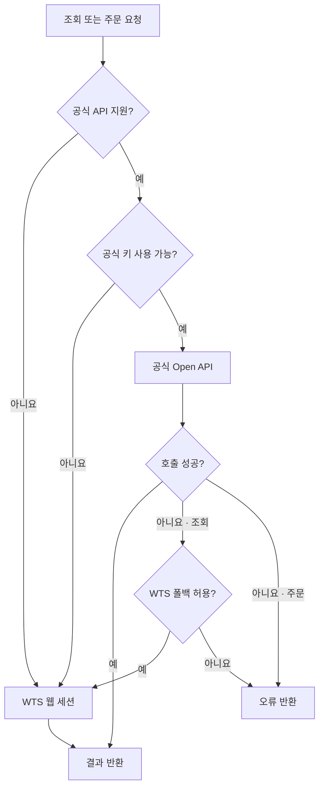

tossctl은 웹 세션(WTS)으로 WTS 전용 기능과 대부분의 hybrid 조회·일반주문을 사용할 수
있습니다. 공식 Open API 키를 등록하면 *공식이 지원하는 기능은 공식 OAuth 경로*로,
공식에 없는 기능은 WTS로 각각 처리하는 **자동 라우팅**이 켜집니다. `account buying-power`,
`market business-days|stocks`, `quote metadata`, 조건주문, `stream` 같은 official-only
명령까지 쓰려면 공식 키도 연결해야 합니다.

## 공식 Open API vs WTS 웹 세션

tossctl이 토스증권에 접근하는 두 경로입니다. 성격이 다르므로 차이를 이해하면 어떤 조합이
필요한지 판단할 수 있습니다.

| | 공식 Open API | WTS 웹 세션 |
|---|---|---|
| 무엇 | 토스가 **공식 제공**하는 OAuth REST API | 토스 웹/앱이 쓰는 **내부 API를 비공식 재사용** |
| 인증 | API Key·Secret → OAuth 액세스 토큰 | QR + 폰 승인 로그인(세션 쿠키) |
| 갱신 | 토큰 **자동 재발급**(무중단) | 약 7일 활동 만료, **폰 푸시 승인** 필요 |
| 커버리지 | 공식 지원 기능(계좌·시세·주문 등) | WTS 기능 — 수급·시장지수·AI 시그널·스크리너·실시간 푸시·소수점 주문 등 포함 |
| 안정성 | 높음(공식 계약, 스펙 버전 관리) | 비공식, **예고 없이 변경 가능** |
| 사전 조건 | 사전 신청·승인 + **허용 IP 등록** | 로그인만 |
| 약관(TOS) | 공식 허용 | **위반 소지** |
| 무인 운영(CI·서버·에이전트) | 적합 | 주기적 사람(폰) 개입 필요 |

요약하면 — **공식 API는 안정적이지만 범위가 좁고, WTS는 고유 범위가 넓지만 비공식이고 세션이
더 자주 끊깁니다.** tossctl은 둘을 합쳐 공식이 커버하는 요청은 공식 경로로(안정), 나머지는
WTS로(범위) 자동 라우팅합니다.

### 실전 시나리오 — 공식으로 막히는 것, tossctl로 되는 것

"범위가 넓다"가 실제로 무슨 차이인지. **공식만으로는 ❌ → tossctl(WTS 포함)이면 ✅**입니다.

#### 세금·손익 (내 계좌 원장)

| 하고 싶은 것 | 공식 | tossctl |
|---|:---:|---|
| 특정 종목으로 지금까지 실제 얼마 벌고 잃었나(실현손익) | ❌ 체결단가 없음 | ✅ `completed_orders` 로 전 기간 체결가 집계 |
| 연도별 배당·원천세 → 금융소득종합과세 대상 판단 | ❌ | ✅ `dividends` (세전/세후·월별) |
| 해외주식 양도세·양도차손 통산 신고자료 | ❌ | ✅ `transactions` + `completed_orders` |
| 손실 종목 실현 시 절세효과 시뮬레이션 | ❌ | ✅ 실현손익 데이터로 계산 |
| 월별 배당 현금흐름(받은 것 + 예정) | ❌ | ✅ `dividends` monthly |

#### 시장 수급·지수 (판단의 무게추)

| 하고 싶은 것 | 공식 | tossctl |
|---|:---:|---|
| 종목별 투자자(개인/외국인/기관) 순매수 흐름 | ❌ 체결량까지만 | ✅ `trading_flows` |
| 코스피·코스닥·VIX 등 지수 | ❌ 개별 종목만 | ✅ `market_indices` / `index_detail` |
| 오늘 외국인·기관이 담은 종목 top | ❌ | ✅ `investor_rankings` |
| 섹터·테마 등락 스캔 | ❌ | ✅ `sectors` / `theme_rankings` |
| 실시간 인기(관심 급등) 종목 | ❌ 종목 지정 필수 | ✅ `stock_ranking` |

#### 리서치·계좌 대시보드

| 하고 싶은 것 | 공식 | tossctl |
|---|:---:|---|
| 조건검색(고배당·저PBR·성장) | ❌ | ✅ `screener_presets` |
| 실적발표(어닝콜) 일정·상세 | ❌ | ✅ `earning_calls` / `earnings_major` / `earning_call_detail` |
| 총자산·평가손익을 한 화면에 | △ `holdings`+`buying_power` 조합 | ✅ `account_summary` 한 번에 |
| 공식 키 없이 보유·대기주문 조회 | ❌ 키 필요 | ✅ `positions` / `pending_orders` |

#### 결합 시나리오 (여기가 진짜 가치)

| 하고 싶은 것 | 공식 | tossctl |
|---|:---:|---|
| 커버드콜 ETF 진짜 총수익(배당 − NAV손실) | ❌ | ✅ `completed_orders` + `dividends` |
| 매수 후 그 종목 수급이 어땠나 사후분석 | ❌ | ✅ `completed_orders` + `trading_flows` |
| 손실 실현이 세금·종합과세에 미치는 영향 통합 판단 | ❌ | ✅ 실현손익 + 배당 + 양도 데이터 |

<Callout type="info" title="한 줄 정리">
공식은 *"아는 종목을 정밀 조회하고 주문을 넣는다"* 까지. tossctl은 여기에 **내 계좌의
실현손익·배당·세금 복기 + 시장 수급·지수 맥락 + 발굴·스크리닝**을 더해, 단순 조회/거래
도구를 **세무·수급·리서치가 붙은 종합 분석 도구**로 확장합니다.
</Callout>

### 공식 API가 한 발 늦는 건 구조 때문입니다

자사 앱과 웹은 새 기능을 가장 빠르게 실험하고 통합하기 좋은 공간입니다. 증권 기능은
**토스증권 WTS와 일반 Toss 앱 안의 증권 모바일 화면**에 먼저 들어갈 수 있고, 외부 공개용
API는 버전·호환성·지원 부담 때문에 안정적인 일부를 뒤따라 엽니다. 반면 일반 Banking/MyData는
대응 WTS 웹앱이 없는 별도 mobile API 영역입니다.

그 결과 수급·시장지수·AI 시그널·스크리너·실시간 푸시 같은 증권 기능은 WTS에 먼저 출시될
수 있습니다. tossctl은 증권의 WTS 경로를 활용하고, 공식이 지원하는 기능은 공식 경로로
자동 라우팅합니다. 카드·소비·일반 은행 거래는 같은 Toss 앱에 보인다는 이유로 WTS 쿠키를
재사용하지 않고 별도 모바일 인증 경계를 검증할 때까지 분리합니다.

<Callout type="info" title="공식 키를 써도 일부 작업은 웹 세션이 필요합니다">
공식 키의 **메타데이터·허용 IP 조회·변경**(`openapi status`, `openapi ip`)은 토스
WTS 내부 엔드포인트(`/api/v1/openapi/client`)로 제공되므로 **웹 세션 로그인이 선행**되어야
합니다. 반면 런타임 호출(계좌·시세·주문)은 세션 없이 OAuth 토큰만으로 동작합니다. 허용 IP는
보통 **키를 쓰는 현재 컴퓨터 IP가 자동 등록**되며, 다른 IP(예: 서버)가 필요하면 WTS(토스 웹)에서
추가로 등록할 수 있습니다. 네트워크가 바뀐 경우 `tossctl openapi ip replace-current`로
preview한 뒤 `--execute --confirm <token>`을 붙여 교체할 수 있습니다.

현재 공인 IP 확인에는 `https://api.ipify.org`를 사용하며, 이 요청에는 토스 쿠키·Open API
키·계좌 정보가 전송되지 않습니다.
</Callout>

## 자동 라우팅 동작

요청마다 "공식이 지원하는가 → 키가 있는가 → 설정(prefer)" 순으로 경로를 고릅니다.



| 요청 조건 | 선택 경로 |
|---|---|
| 공식 API 미지원 기능 | → **WTS 웹 세션** |
| 공식 지원 · 공식 키 없음 | → **WTS 웹 세션** |
| 공식 지원 · 공식 키 있음 | → **공식 Open API (OAuth)** |
| 공식 경로 일시 실패 | → 주문이면 **오류**(중복 방지), 그 외 **WTS 폴백** |

- 공식이 지원하는 조회·거래는 OAuth 토큰으로 라우팅 → 더 안정적
- 공식 범위 밖(수급·시장지수·AI 시그널 등)은 항상 WTS
- 공식 경로가 일시적으로 불가하면 WTS로 자동 폴백(stderr 한 줄 알림)
- **주문은 교차 폴백하지 않음** (중복 주문 방지를 위해 공식 경로 실패 시 그냥 오류)

## 어떤 인증이 필요한가

| 시나리오 | 웹 세션 | 공식 키 | 비고 |
|---|:---:|:---:|---|
| 공식 지원 기능만 (가장 안정적) | 초기 설정 시 필요 | 필요 | 런타임은 토큰만, 키 IP·메타 조회엔 세션 필요 |
| 고유·비공식 기능까지 전부 | 필요 | 불필요 | 더 빨리 끊김, 갱신 주기 짧음 |
| **둘 다 (권장)** | **필요** | **필요** | **최대 안정성 + 최대 범위 + 폴백** |

<Callout type="info" title="공식 키 등록 이점">
공식 키를 연결하면 tossctl이 OAuth 토큰을 **무중단으로 자동 재발급**합니다. CI·서버·에이전트에서 사람 개입 없이 무인 운영할 수 있고, 웹 세션 대비 만료 주기가 훨씬 길며, 토스 내부 API 변경의 영향도 적습니다.
</Callout>

## 공식 Open API 키 발급

1. **사전 신청** — [corp.tossinvest.com/ko/open-api](https://corp.tossinvest.com/ko/open-api) 에서 신청합니다.
2. **공식 문서** — [developers.tossinvest.com/docs](https://developers.tossinvest.com/docs) 에서 전체 스펙을 확인합니다.
3. **키 발급** — 승인 후 **토스 앱 설정 > Open API** 에서 API Key · Secret을 발급합니다.
4. **허용 IP** — 키를 쓰는 현재 컴퓨터 IP는 보통 자동으로 등록됩니다. 다른 IP(예: 서버)가 필요하면 WTS(토스 웹)에서 추가로 등록할 수 있습니다. 미등록 IP에서 요청하면 차단됩니다 (`tossctl openapi status` 로 진단 — IP 목록 조회에는 웹 세션이 필요).

## 시크릿 안전 취급

<Callout type="warn" title="키·시크릿은 비밀번호와 같습니다">
유출되면 즉시 토스 앱에서 재발급하세요.
</Callout>

### 권장 방법 (우선순위 순)

**① 환경변수 (CI·에이전트·자동화 환경 권장)**

```bash
export TOSSCTL_OPENAPI_KEY=tsck_live_xxxxxxxxxxxxxxxxxxxx
export TOSSCTL_OPENAPI_SECRET=tssk_live_xxxxxxxxxxxxxxxxxxxx
tossctl openapi status   # 환경변수 자동 인식
```

**② `tossctl openapi login` 이 만드는 자격증명 파일 (개인 개발 환경)**

```bash
tossctl openapi login \
  --key tsck_live_xxxxxxxxxxxxxxxxxxxx \
  --secret tssk_live_xxxxxxxxxxxxxxxxxxxx
# → <config dir>/openapi-credentials.json (권한 0600) 에 저장
```

### 절대 하지 말 것

- 채팅·이슈·PR·커밋·스크린샷·로그에 평문 키·시크릿 붙여넣기
- `config.json`·코드·문서에 하드코딩
- `--key`/`--secret` 플래그 직접 입력 (셸 히스토리에 남음) — 환경변수를 씁니다
- 허용 IP를 `0.0.0.0/0` 등 무제한으로 설정하지 말 것
- 유출이 의심되면 **토스 앱에서 즉시 재발급**하세요

## 온보딩 위저드

처음 설정한다면 `tossctl init` 으로 안내를 따르세요.

```bash
tossctl init
# 웹 세션 로그인 여부 확인 → 공식 키 입력 여부 → 거래 설정까지 단계별 안내
```

## 공식 키 관리 커맨드

### 등록 / 갱신

```bash
# 환경변수로 넘기거나 대화형으로 입력
tossctl openapi login
tossctl openapi login --key tsck_live_xxxx --secret tssk_live_xxxx
```

### 상태 확인 · 진단

```bash
tossctl openapi status
# 출력 예:
#   Official key : ✓ (set via file)
#   Token        : valid (expires in 23m 41s)
#   Allowed IPs  : 203.0.113.42 ✓ (current IP matches)   # 웹 세션 필요
#   Routing      : auto (official + wts)
```

`status` 는 일반적인 오류 원인을 설명해 줍니다:
- `허용 IP 미등록` — 현재 출구 IP 가 키 허용 목록에 없음
- `IP 목록 조회 실패(웹세션 필요)` — 허용 IP 조회는 WTS 세션이 선행되어야 함 (`tossctl auth login`)
- `토큰 만료` — 재발급은 자동, 수동 강제 갱신: `tossctl openapi login`
- `키 미설정` — 환경변수 또는 `openapi login` 필요

### 연결 테스트

```bash
tossctl openapi test
# → 실제 API 호출로 키 + IP + 토큰을 검증합니다
```

### 로그아웃 (자격증명 파일 삭제)

```bash
tossctl openapi logout
```

## 백엔드 라우팅 제어

### 전역 플래그 `--backend`

```bash
tossctl account summary --backend openapi   # 공식 경로 우선 (fallback 설정 유지)
tossctl account summary --backend wts        # WTS 고정 (공식 경로 비활성화)
tossctl account summary --backend auto       # 기본값: 자동 라우팅
```

> `official` 은 `openapi` 의 deprecated 별칭으로 계속 동작합니다(`--backend official`, `openapi.prefer: "official"`). 신규 설정은 `openapi` 를 쓰세요.

### Config 항목 `openapi.*`

```json
{
  "openapi": {
    "enabled": true,
    "prefer": "openapi",
    "fallback": true
  }
}
```

| 키 | 설명 |
|---|---|
| `openapi.enabled` | 공식 경로 사용 여부 (기본 `true`, 키 있을 때만 실제 활성화) |
| `openapi.prefer` | `"auto"` \| `"openapi"` \| `"wts"` — 공식이 지원하는 기능의 시작 경로 (`auto`·`openapi`는 공식 우선, `wts`는 공식 비활성화) |
| `openapi.fallback` | 공식 경로 실패 시 WTS 폴백 허용 (기본 `true`; 주문은 항상 `false`) |

## 폴백 · 소스 표시

공식 경로가 일시적으로 쓸 수 없을 때 tossctl은 WTS로 자동 전환하고 stderr에 한 줄을 출력합니다:

```
[tossctl] official route unavailable, falling back to wts (account summary)
```

폴백이 잦으면 `tossctl openapi status` 와 `tossctl doctor` 로 원인을 확인하세요.

---

공식 지원 범위 전체 목록은 [지원 범위](/docs/reference/support-scope) 페이지를 참고하세요.
