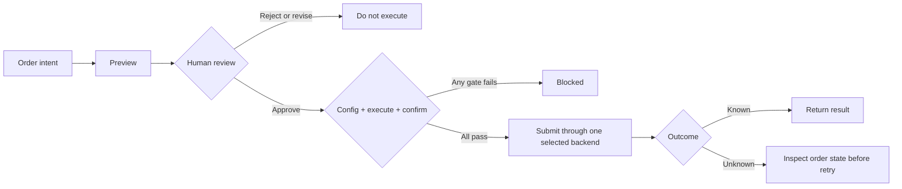

tossctl keeps reads open but guards **trading with multiple gates** to prevent accidents.

## Disabled by default

All trading actions are off after install. Orders, cancels, and amends fail unless you
explicitly allow them in `config.json`.

```json
{
  "trading": {
    "place": true,
    "sell": true,
    "allow_live_order_actions": true
  }
}
```

- Without `place`, no order can be placed.
- Selling requires the additional `sell` grant (the user scopes "buy-only / include sell").
- `allow_live_order_actions` is the master kill switch for every live-account order.

## Two-step execution gate



A live trade requires both:

```bash
tossctl order place --symbol TSLA --side buy --qty 1 --price 250 \
  --execute --confirm <token>
```

- Without `--execute`, everything is treated as dry-run.
- The `--confirm <token>` value comes from the confirmation flow — it cannot be guessed or bypassed.

## Always preview first

`order preview` computes quantity, price, fill amount, and commission without sending an order.

```bash
tossctl order preview --symbol TSLA --side buy --qty 1 --price 250
```

Agents must follow **preview → user confirmation → place**.

## Market symmetry

KR and US trading use the same gate. (A KR order is no riskier than a US one, so the old
asymmetric option was removed.)

## Privacy

- Login intermediate files, QR images, and the session folder are stored owner-only (`0600`).
- `doctor --report` JSON masks home paths automatically.
- `monitor` alert paths never forward response bodies (account numbers, balances) externally.

## Agent notes

Follow the rules in the [AI Agent Guide](/en/docs/guide/agents) — especially no gate bypass, no real
data exposure, and preview-before-place.
