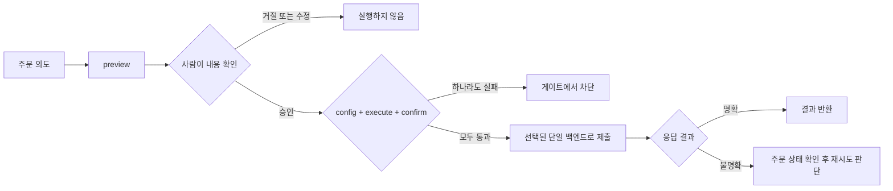

tossctl 은 조회는 자유롭게, **거래는 여러 단계로 막아** 사고를 방지합니다.

## 기본 비활성

설치 직후 모든 거래 기능은 꺼져 있습니다. `config.json` 에서 명시적으로 허용하지 않으면
주문·취소·정정이 실패합니다.

```json
{
  "trading": {
    "place": true,
    "sell": true,
    "allow_live_order_actions": true
  }
}
```

- `place` 없이는 주문 자체가 불가
- 매도는 `sell` 추가 허용 필요 (유저가 "매수만 / 매도 포함"을 스스로 범위 제한)
- `allow_live_order_actions`는 모든 실계좌 주문의 마스터 킬스위치

## 실행 2단계 게이트



실거래는 두 가지를 모두 줘야 나갑니다.

```bash
tossctl order place --symbol TSLA --side buy --qty 1 --price 250 \
  --execute --confirm <token>
```

- `--execute` 없이는 전부 dry-run으로 취급
- `--confirm <token>` 의 토큰은 확인 흐름에서 나온 값 — 추측·우회 불가

## 항상 미리보기 먼저

`order preview` 는 주문을 보내지 않고 수량·가격·체결금액·수수료를 계산해 보여줍니다.

```bash
tossctl order preview --symbol TSLA --side buy --qty 1 --price 250
```

에이전트는 **반드시 preview → 사용자 확인 → place** 순서를 지켜야 합니다.

## 시장 대칭

국내(KR)와 미국(US) 거래는 동일한 게이트를 적용합니다. (KR 주문이 US 주문보다 더
위험하지 않으므로, 과거의 비대칭 옵션은 제거됐습니다.)

## 개인정보 보호

- 로그인 중간 파일·QR 이미지·세션 폴더는 소유자 전용 권한(`0600`)으로 저장됩니다.
- `doctor --report` 의 JSON 진단은 홈 경로를 자동 마스킹합니다.
- `monitor` 알림 경로는 응답 본문(계좌번호·잔고 등)을 외부로 전달하지 않습니다.

## 에이전트 주의사항

[AI 에이전트 가이드](/docs/guide/agents)에 정리된 규칙을 따르세요 — 특히 거래 게이트 우회 금지,
실데이터 비노출, preview 선행.
